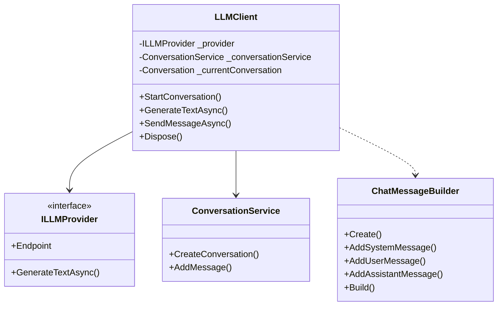

# LLMKit Architecture

This document outlines the architecture and design principles of LLMKit.

## Core Components

### 1. LLMClient
The main entry point for interacting with LLM providers.

```csharp
public class LLMClient : IDisposable
{
    private readonly ILLMProvider _provider;
    private readonly ConversationService _conversationService;
    private readonly object _conversationLock = new();
    private Conversation? _currentConversation;
    // ...
}
```

Key responsibilities:
- Managing conversations
- Handling text generation requests
- Managing provider interactions
- Thread safety
- Resource disposal

### 2. Providers
Abstract interface and implementations for different LLM providers.

```csharp
public interface ILLMProvider
{
    Uri Endpoint { get; }
    Task<LLMResponse> GenerateTextAsync(LLMRequest request, CancellationToken cancellationToken = default);
}
```

Supported providers:
- OpenAI
- Gemini
- DeepSeek

### 3. Conversation Management
Internal service for managing conversation state and message history.

```csharp
internal class ConversationService
{
    public Conversation CreateConversation(int maxMessages)
    public void AddMessage(Conversation conversation, string role, string content)
}
```

### 4. Message Building
Fluent API for constructing messages.

```csharp
internal sealed class ChatMessageBuilder
{
    public static ChatMessageBuilder Create() => new();
    public ChatMessageBuilder AddSystemMessage(string content)
    public ChatMessageBuilder AddUserMessage(string content)
    public ChatMessageBuilder AddAssistantMessage(string content)
    public IReadOnlyList<ChatMessage> Build()
}
```

## Design Principles

### 1. SOLID Principles
- **Single Responsibility**: Each class has a single, well-defined purpose
- **Open/Closed**: Easy to extend with new providers
- **Liskov Substitution**: Providers can be swapped without affecting client code
- **Interface Segregation**: Clean interfaces for each component
- **Dependency Inversion**: Provider abstraction through ILLMProvider

### 2. Thread Safety
- Lock-based synchronization for shared resources
- Immutable objects where possible
- Thread-safe collections
- Concurrent access protection

### 3. Resource Management
- Proper implementation of IDisposable
- Using statements for automatic disposal
- Cleanup of resources in Dispose method

### 4. Error Handling
- Custom exceptions for LLM-specific errors
- Proper exception propagation
- Comprehensive error messages

## Class Diagram



## Extension Points

1. **New Providers**
   - Implement `ILLMProvider`
   - Add provider-specific request/response models
   - Register in DI container

2. **Message Building**
   - Extend `ChatMessageBuilder`
   - Add custom message types
   - Implement custom formatting

## Best Practices

1. **Thread Safety**
   - Use locks for shared resources
   - Keep locks as short as possible
   - Avoid nested locks
   - Protect concurrent access to shared state

2. **Resource Management**
   - Always use using statements
   - Implement IDisposable properly
   - Clean up resources in Dispose

3. **Error Handling**
   - Use custom exceptions
   - Provide detailed error messages
   - Handle cancellation properly

4. **Testing**
   - Mock ILLMProvider for testing
   - Test thread safety
   - Test resource cleanup 